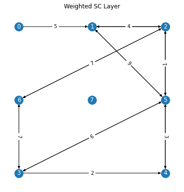

# Preferred Paths

Used to compute preferred navigation paths in the human brain.

## Requirements

Requires installation of:

- python 3
- numpy
- scipy

## Setup

- Install all requirements listed above
- Clone the contents of https://github.com/alex-mobileapps/preferred-paths
- Create a new python script in the `preferred-paths` directory

```
git clone https://github.com/alex-mobileapps/preferred-paths
cd preferred-paths
touch demo.py
```

## Extracting brain features
`Brain` objects are used to extract features of the brain, such as node strengths, streamlines and binarised SC and FC layers
```
# demo.py

import numpy as np
from brain import Brain

sc = np.array(
    [[ 0, 5, 0, 0, 0, 0, 0, 0],
     [ 0, 0, 4, 0, 0, 9, 0, 0],
     [ 0, 4, 0, 0, 0, 1, 7, 0],
     [ 0, 0, 0, 0, 2, 6, 7, 0],
     [ 0, 0, 0, 0, 0, 3, 0, 0],
     [ 0, 9, 1, 6, 3, 0, 0, 0],
     [ 0, 0, 7, 7, 0, 0, 0, 0],
     [ 0, 0, 0, 0, 0, 0, 0, 0]])

fc = np.array(
    [[ 0,  0,  1,  0, -2,  0,  2,  0],
     [ 0,  0, -2, -1,  0,  0, -4,  0],
     [ 1, -2,  0, -2,  0, -1, 17,  2],
     [ 0, -1, -2,  0,  1, -1,  1, -2],
     [-2,  0,  0,  1,  0,  6, -1,  2],
     [ 0,  0, -1, -1,  6,  0,  5, 13],
     [ 2, -4, 17,  1, -1,  5,  0, 11],
     [ 0,  0,  2, -2,  2, 13, 11,  0]])

euc_dist = np.array(
    [[ 0, 31, 63, 34, 29, 39, 76, 32],
     [31,  0, 60, 30, 26, 38, 83, 45],
     [63, 60,  0, 64, 62, 67, 96, 67],
     [34, 30, 64,  0, 29, 38, 69, 46],
     [29, 26, 62, 29,  0, 33, 82, 40],
     [39, 38, 67, 38, 33,  0, 77, 46],
     [76, 83, 96, 69, 82, 77,  0, 76],
     [32, 45, 67, 46, 40, 46, 76,  0]])

hubs = [1, 4, 5]

regions = [0, 0, 1, 2, 2, 2, 3, 4]

brain = Brain(sc=sc, fc=fc, euc_dist=euc_dist, sc_directed=True, sc_thresh=1, fc_thresh=0.01, hubs=hubs, regions=regions)
```

### Streamlines
Number of streamlines between any two nodes
```
print(brain.streamlines(weighted=True))

# [[0 5 0 0 0 0 0 0]
#  [0 0 4 0 0 9 0 0]
#  [0 4 0 0 0 1 7 0]
#  [0 0 0 0 2 6 7 0]
#  [0 0 0 0 0 3 0 0]
#  [0 9 1 6 3 0 0 0]
#  [0 0 7 7 0 0 0 0]
#  [0 0 0 0 0 0 0 0]]
```

### Edge length
Lengths of edges between any two nodes
```
print(brain.edge_length())

# [[ 0 31 63 34 29 39 76 32]
#  [31  0 60 30 26 38 83 45]
#  [63 60  0 64 62 67 96 67]
#  [34 30 64  0 29 38 69 46]
#  [29 26 62 29  0 33 82 40]
#  [39 38 67 38 33  0 77 46]
#  [76 83 96 69 82 77  0 76]
#  [32 45 67 46 40 46 76  0]]
```

### Edge angle change
The magnitude of the change in angle (radians) compared to the previous edge's direction
```
print(brain.edge_angle_change(loc=1, nxt=2, prev_nodes=[0]))

# 1.7306155993472998
```

### Node strength
Number of streamlines attached to each node
```
print(brain.node_strength(weighted=True, method='in'))

# [ 0 18 12 13  5 19 14  0]

print(brain.node_strength(weighted=True, method='out'))

# [ 5 13 12 15  3 19 14  0]

print(brain.node_strength(weighted=True, method='tot'))

# [ 5 31 24 28  8 38 28  0]
```

### Node strength dissimilarity
The magnitude of difference in the number of streamlines of any two nodes
```
print(brain.node_strength_dissimilarity(weighted=True, method='out'))

# [[ 0  8  7 10  2 14  9  5]
#  [ 8  0  1  2 10  6  1 13]
#  [ 7  1  0  3  9  7  2 12]
#  [10  2  3  0 12  4  1 15]
#  [ 2 10  9 12  0 16 11  3]
#  [14  6  7  4 16  0  5 19]
#  [ 9  1  2  1 11  5  0 14]
#  [ 5 13 12 15  3 19 14  0]]
```

### Node prevalence in SC-FC paths
The number of SC-FC triangles centred on each node (varies depending on if the graph is directed or not)
```
print(brain.triangle_node_prevalence())

# [0 1 2 2 0 1 0 0]
```

### Edge prevalence in SC-FC paths
The number of SC-FC triangles that involve each edge
```
print(brain.triangle_edge_prevalence())

# [[0 1 0 0 0 0 0 0]
#  [0 0 1 0 0 0 0 0]
#  [0 0 0 0 0 1 1 0]
#  [0 0 0 0 0 1 1 0]
#  [0 0 0 0 0 1 0 0]
#  [0 0 1 2 0 0 0 0]
#  [0 0 1 1 0 0 0 0]
#  [0 0 0 0 0 0 0 0]]
```

### Hops to previously used nodes
The smallest number of hops of all previously visited nodes to a potential next node
```
print(brain.hops_to_prev_used_nodes(nxt=4, prev_nodes=[0,1]))

# 2.0
```

### Distance to previously used nodes
The smallest Euclidean distance of all previously visited nodes to a potential next node
```
print(brain.dist_to_prev_used_nodes(nxt=4, prev_nodes=[0,1]))

# 26
```

### Is target node
Whether or not the potential next node is the target node
```
print(brain.is_target_node(nxt=0, target=2))

# 0

print(brain.is_target_node(nxt=2, target=2))

# 1
```

### Is target region
Returns whether or not a potential next node is in the target node's region
```
print(brain.is_target_region(nxt=3, target=5))

# 1

print(brain.is_target_region(nxt=3, target=1))

# 0
```

### Hubs
Hub nodes in the brain
```
print(brain.hubs(binary=False))

# [1 4 5]

print(brain.hubs(binary=True))

# [0 1 0 0 1 1 0 0]
```

### Neighbour of just visited node
Returns whether or not a potential next node neighbours the most recently visited node
```
print(brain.neighbour_just_visited_node(nxt=1, prev_nodes=[4,5]))

# 1

print(brain.neighbour_just_visited_node(nxt=6, prev_nodes=[4,5]))

# 0
```

### Shortest paths
Lengths of the shortest paths between nodes
```
print(brain.shortest_paths(method='hops'))

# [[ 0.  1.  2.  3.  3.  2.  3. -1.]
#  [-1.  0.  1.  2.  2.  1.  2. -1.]
#  [-1.  1.  0.  2.  2.  1.  1. -1.]
#  [-1.  2.  2.  0.  1.  1.  1. -1.]
#  [-1.  2.  2.  2.  0.  1.  3. -1.]
#  [-1.  1.  1.  1.  1.  0.  2. -1.]
#  [-1.  2.  1.  1.  2.  2.  0. -1.]
#  [-1. -1. -1. -1. -1. -1. -1.  0.]]
```

## Preferred paths
`PreferredPath` objects are used to return the predicted navigation paths in the brain, based on supplied criteria and weights
```
from preferred_path import PreferredPath
```

Each criteria is a function that returns a non-scaled 'score' (scores are automatically scaled during the algorithm) for visiting that node (higher scores are preferred).

These functions must be able to take 4 arguments:
- current location
- next location
- previously visited nodes
- target node

Different weights are given to each criteria to determine the overall scores for each potential next node.

An adjacency matrix is supplied to specify which edges exist in the network

```
# Criteria functions
node_str = brain.node_strength(weighted=False)
streamlines = brain.streamlines()
fn_vector = [
    lambda loc, nxt, prev_nodes, target: streamlines[loc,nxt],
    lambda loc, nxt, prev_nodes, target: node_str[nxt]]

# Criteria weights
fn_weights = [0.4, 0.7]

# Preferred path object
pp = PreferredPath(adj=brain.sc_bin, fn_vector=fn_vector, fn_weights=fn_weights)
```



### Navigation algorithms
- **Revisits**: Previously visited nodes can be selected as the next location (fails on revisit cycles, dead-ends and disconnected graphs)
- **Forward**: Previously visited nodes cannot be selected as the next location (fails on dead-ends and disconnected graphs)
- **Backtracking**: Same as 'Forward', except backing out of dead-ends are allowed to find alternative routes (fails on disconnected graphs)

For each algorithm, the weighted scores determine which of the available nodes are selected next in the path. If multiple nodes have the highest score, one of them is selected at random. A warning message is printed in such instances.

### Finding single paths
```
print(pp.retrieve_single_path(source=0, target=5, method='rev', out_path=True))
print(pp.retrieve_single_path(source=0, target=5, method='rev', out_path=False))

# [0, 1, 5]
# 2

print(pp.retrieve_single_path(source=0, target=2, method='fwd', out_path=True))
print(pp.retrieve_single_path(source=0, target=2, method='fwd', out_path=False))

# [0, 1, 5, 3, 6, 2]
# 5

print(pp.retrieve_single_path(source=0, target=4, method='back', out_path=True))
print(pp.retrieve_single_path(source=0, target=4, method='back', out_path=False))

# [0, 1, 5, 3, 4]
# 4
```

### Finding all paths
```
all_paths = pp.retrieve_all_paths(method='back', out_path=True)
all_lengths = pp.retrieve_all_paths(method='back', out_path=False)

print(all_paths)

# {
#     0: {                      # Source node 0
#         1: [0, 1],            # Target node 1 and path sequence
#         2: [0, 1, 5, 3, 6, 2]
#         ...
#     }
#     ...
# }

print(all_paths[0][2])

# [0, 1, 5, 3, 6, 2]

print(all_lengths)

# [[ 0.  1.  5.  3.  4.  2.  4. -1.]
#  [-1.  0.  4.  2.  3.  1.  3. -1.]
#  [-1.  2.  0.  2.  3.  1.  3. -1.]
#  [-1.  2.  3.  0.  2.  1.  4. -1.]
#  [-1.  2.  3.  5.  0.  1.  4. -1.]
#  [-1.  1.  2.  4.  5.  0.  3. -1.]
#  [-1.  2.  1.  4.  5.  3.  0. -1.]
#  [-1. -1. -1. -1. -1. -1. -1.  0.]]

print(all_lengths[0][2])

# 5
```

### Updating weights
```
pp.fn_weights = [0.2, 3.1]
print(pp.retrieve_all_paths(method='back', out_path=False))

# [[ 0.  1.  3.  5.  6.  2.  4. -1.]
#  [-1.  0.  2.  4.  5.  1.  3. -1.]
#  [-1.  2.  0.  2.  3.  1.  3. -1.]
#  [-1.  3.  2.  0.  2.  1.  3. -1.]
#  [-1.  3.  2.  4.  0.  1.  3. -1.]
#  [-1.  2.  1.  3.  4.  0.  2. -1.]
#  [-1.  3.  1.  3.  4.  2.  0. -1.]
#  [-1. -1. -1. -1. -1. -1. -1.  0.]]
```